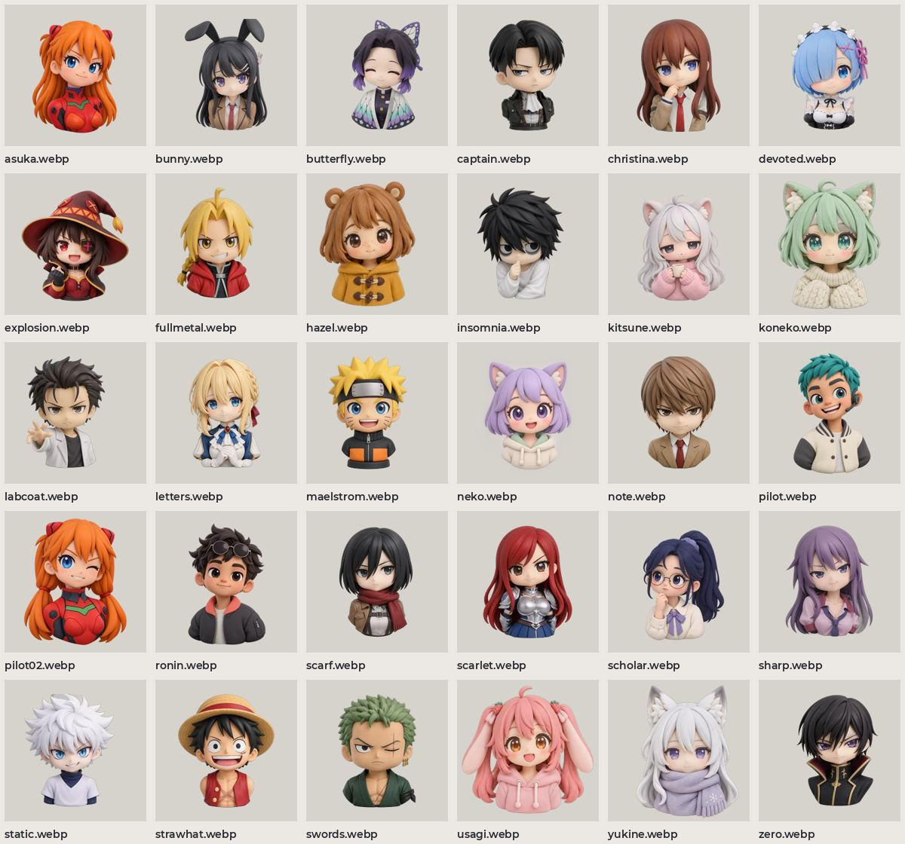

# Аниме-портреты

30 глиняных чиби-портретов для аватаров и косметики AnteikuAnon, 256 px. Исходники 1024 px в originals/anime-portraits.

| файл | размер |
| --- | --- |
| `asuka.webp` | 256×256 |
| `bunny.webp` | 256×256 |
| `butterfly.webp` | 256×256 |
| `captain.webp` | 256×256 |
| `christina.webp` | 256×256 |
| `devoted.webp` | 256×256 |
| `explosion.webp` | 256×256 |
| `fullmetal.webp` | 256×256 |
| `hazel.webp` | 256×256 |
| `insomnia.webp` | 256×256 |
| `kitsune.webp` | 256×256 |
| `koneko.webp` | 256×256 |
| `labcoat.webp` | 256×256 |
| `letters.webp` | 256×256 |
| `maelstrom.webp` | 256×256 |
| `neko.webp` | 256×256 |
| `note.webp` | 256×256 |
| `pilot.webp` | 256×256 |
| `pilot02.webp` | 256×256 |
| `ronin.webp` | 256×256 |
| `scarf.webp` | 256×256 |
| `scarlet.webp` | 256×256 |
| `scholar.webp` | 256×256 |
| `sharp.webp` | 256×256 |
| `static.webp` | 256×256 |
| `strawhat.webp` | 256×256 |
| `swords.webp` | 256×256 |
| `usagi.webp` | 256×256 |
| `yukine.webp` | 256×256 |
| `zero.webp` | 256×256 |
