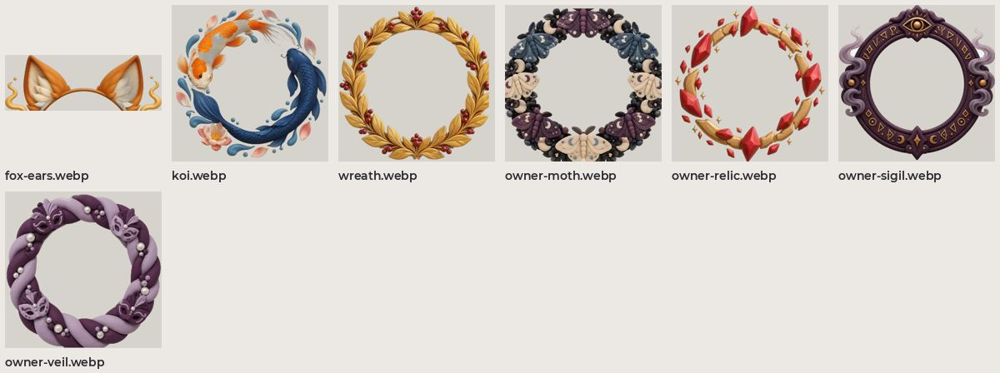

# Рамки аватара

Косметические рамки вокруг аватара: лисьи ушки, кои, лавровый венок и рамки владельца (мотыльки, реликвия, сигил, вуаль).

| файл | размер |
| --- | --- |
| `fox-ears.webp` | 360×128 |
| `koi.webp` | 360×360 |
| `wreath.webp` | 360×360 |
| `owner-moth.webp` | 360×360 |
| `owner-relic.webp` | 360×360 |
| `owner-sigil.webp` | 360×360 |
| `owner-veil.webp` | 360×360 |
