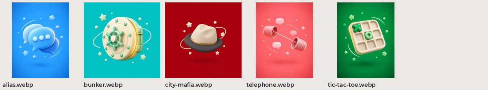

# Обложки игр

Главный шаблон стиля: крупный глянцевый глиняный объект на сплошном насыщенном фоне, звёзды, шарики и тонкая орбита. Портрет 3:4 или квадрат. Используются в AnteikuAnon на экране игр.

| файл | размер |
| --- | --- |
| `alias.webp` | 540×720 |
| `bunker.webp` | 720×720 |
| `city-mafia.webp` | 720×720 |
| `telephone.webp` | 540×720 |
| `tic-tac-toe.webp` | 540×720 |
