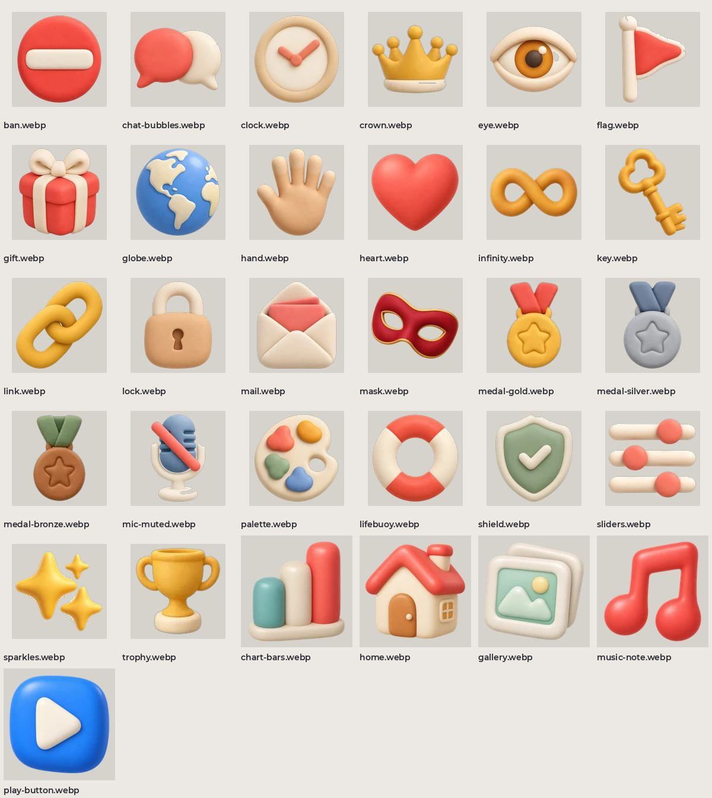

# Глиняные иконки

Общий набор меток семьи Anteiku: матовая глина, прозрачный фон, одна оптическая величина. Ими называют разделы и пункты меню.

| файл | размер |
| --- | --- |
| `ban.webp` | 160×160 |
| `chat-bubbles.webp` | 160×160 |
| `clock.webp` | 160×160 |
| `crown.webp` | 160×160 |
| `eye.webp` | 160×160 |
| `flag.webp` | 160×160 |
| `gift.webp` | 160×160 |
| `globe.webp` | 160×160 |
| `hand.webp` | 160×160 |
| `heart.webp` | 160×160 |
| `infinity.webp` | 160×160 |
| `key.webp` | 160×160 |
| `link.webp` | 160×160 |
| `lock.webp` | 160×160 |
| `mail.webp` | 160×160 |
| `mask.webp` | 160×160 |
| `medal-gold.webp` | 160×160 |
| `medal-silver.webp` | 160×160 |
| `medal-bronze.webp` | 160×160 |
| `mic-muted.webp` | 160×160 |
| `palette.webp` | 160×160 |
| `lifebuoy.webp` | 160×160 |
| `shield.webp` | 160×160 |
| `sliders.webp` | 160×160 |
| `sparkles.webp` | 160×160 |
| `trophy.webp` | 160×160 |
| `chart-bars.webp` | 192×192 |
| `home.webp` | 192×192 |
| `gallery.webp` | 192×192 |
| `music-note.webp` | 192×192 |
| `play-button.webp` | 192×192 |
