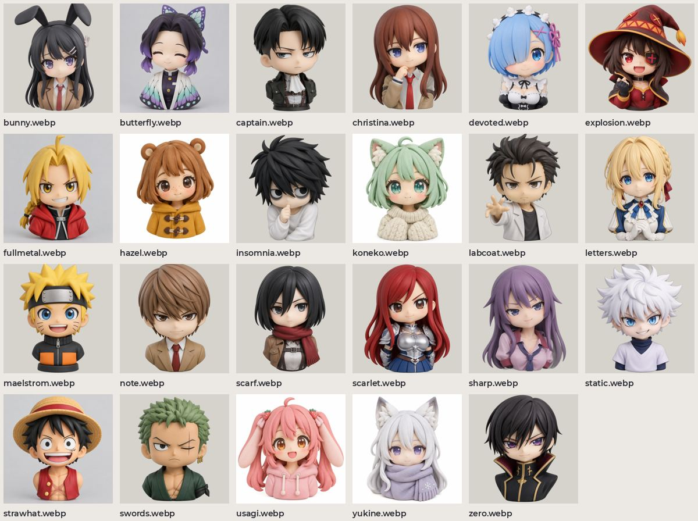

# Исходники: портреты

Аниме-портреты в 1024 px, где есть, с вырезанным фоном.

| файл | размер |
| --- | --- |
| `bunny.webp` | 1024×1024 |
| `butterfly.webp` | 1024×1024 |
| `captain.webp` | 1024×1024 |
| `christina.webp` | 1024×1024 |
| `devoted.webp` | 1024×1024 |
| `explosion.webp` | 1024×1024 |
| `fullmetal.webp` | 1024×1024 |
| `hazel.webp` | 1024×1024 |
| `insomnia.webp` | 1024×1024 |
| `koneko.webp` | 1024×1024 |
| `labcoat.webp` | 1024×1024 |
| `letters.webp` | 1024×1024 |
| `maelstrom.webp` | 1024×1024 |
| `note.webp` | 1024×1024 |
| `scarf.webp` | 1024×1024 |
| `scarlet.webp` | 1024×1024 |
| `sharp.webp` | 1024×1024 |
| `static.webp` | 1024×1024 |
| `strawhat.webp` | 1024×1024 |
| `swords.webp` | 1024×1024 |
| `usagi.webp` | 1024×1024 |
| `yukine.webp` | 1024×1024 |
| `zero.webp` | 1024×1024 |
