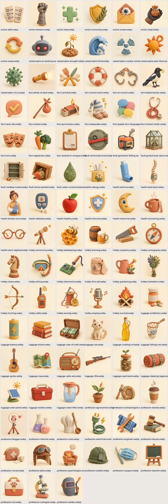

# Исходники: колода Бункера

93 карты в 1024 px, webp q90. Для печати, крупных экранов и перерисовки.

| файл | размер |
| --- | --- |
| `action-alibi.webp` | 1024×1024 |
| `action-dictator.webp` | 1024×1024 |
| `action-heal.webp` | 1024×1024 |
| `action-immunity.webp` | 1024×1024 |
| `action-reveal.webp` | 1024×1024 |
| `action-steal.webp` | 1024×1024 |
| `action-swap.webp` | 1024×1024 |
| `catastrophe-ai-uprising.webp` | 1024×1024 |
| `catastrophe-drought.webp` | 1024×1024 |
| `catastrophe-flood.webp` | 1024×1024 |
| `catastrophe-nuclear-winter.webp` | 1024×1024 |
| `catastrophe-solar-flare.webp` | 1024×1024 |
| `catastrophe-virus.webp` | 1024×1024 |
| `fact-afraid-of-dark.webp` | 1024×1024 |
| `fact-cannibal.webp` | 1024×1024 |
| `fact-cannot-swim.webp` | 1024×1024 |
| `fact-ex-convict.webp` | 1024×1024 |
| `fact-kleptomaniac.webp` | 1024×1024 |
| `fact-never-lies.webp` | 1024×1024 |
| `fact-orphan.webp` | 1024×1024 |
| `fact-pyromaniac.webp` | 1024×1024 |
| `fact-sleepwalks.webp` | 1024×1024 |
| `fact-speaks-four-languages.webp` | 1024×1024 |
| `fact-trained-medic.webp` | 1024×1024 |
| `fact-twin.webp` | 1024×1024 |
| `fact-vegetarian.webp` | 1024×1024 |
| `fact-worked-in-morgue.webp` | 1024×1024 |
| `fault-airlock-jammed.webp` | 1024×1024 |
| `fault-generator-failing.webp` | 1024×1024 |
| `fault-greenhouse-down.webp` | 1024×1024 |
| `fault-medbay-looted.webp` | 1024×1024 |
| `fault-stores-spoiled.webp` | 1024×1024 |
| `fault-water-contaminated.webp` | 1024×1024 |
| `health-allergy.webp` | 1024×1024 |
| `health-asthma.webp` | 1024×1024 |
| `health-bad-back.webp` | 1024×1024 |
| `health-broken-arm.webp` | 1024×1024 |
| `health-diabetes.webp` | 1024×1024 |
| `health-healthy.webp` | 1024×1024 |
| `health-immune.webp` | 1024×1024 |
| `health-insomnia.webp` | 1024×1024 |
| `health-recovering.webp` | 1024×1024 |
| `health-short-sighted.webp` | 1024×1024 |
| `hobby-astronomy.webp` | 1024×1024 |
| `hobby-beekeeping.webp` | 1024×1024 |
| `hobby-brewing.webp` | 1024×1024 |
| `hobby-carpentry.webp` | 1024×1024 |
| `hobby-cartography.webp` | 1024×1024 |
| `hobby-chess.webp` | 1024×1024 |
| `hobby-diving.webp` | 1024×1024 |
| `hobby-electronics.webp` | 1024×1024 |
| `hobby-first-aid.webp` | 1024×1024 |
| `hobby-gardening.webp` | 1024×1024 |
| `hobby-herbalism.webp` | 1024×1024 |
| `hobby-hunting.webp` | 1024×1024 |
| `hobby-radio.webp` | 1024×1024 |
| `hobby-sewing.webp` | 1024×1024 |
| `hobby-singing.webp` | 1024×1024 |
| `hobby-survival.webp` | 1024×1024 |
| `luggage-antibiotics.webp` | 1024×1024 |
| `luggage-battery.webp` | 1024×1024 |
| `luggage-books.webp` | 1024×1024 |
| `luggage-case-of-cash.webp` | 1024×1024 |
| `luggage-cat.webp` | 1024×1024 |
| `luggage-cooking-oil.webp` | 1024×1024 |
| `luggage-fishing-net.webp` | 1024×1024 |
| `luggage-guitar.webp` | 1024×1024 |
| `luggage-map.webp` | 1024×1024 |
| `luggage-radio-set.webp` | 1024×1024 |
| `luggage-rifle.webp` | 1024×1024 |
| `luggage-seed-bank.webp` | 1024×1024 |
| `luggage-sleeping-bags.webp` | 1024×1024 |
| `luggage-solar-panel.webp` | 1024×1024 |
| `luggage-toolbox.webp` | 1024×1024 |
| `luggage-water-filter.webp` | 1024×1024 |
| `profession-agronomist.webp` | 1024×1024 |
| `profession-archaeologist.webp` | 1024×1024 |
| `profession-barista.webp` | 1024×1024 |
| `profession-blogger.webp` | 1024×1024 |
| `profession-chemist.webp` | 1024×1024 |
| `profession-cook.webp` | 1024×1024 |
| `profession-electrician.webp` | 1024×1024 |
| `profession-engineer.webp` | 1024×1024 |
| `profession-lawyer.webp` | 1024×1024 |
| `profession-nurse.webp` | 1024×1024 |
| `profession-pilot.webp` | 1024×1024 |
| `profession-psychologist.webp` | 1024×1024 |
| `profession-soldier.webp` | 1024×1024 |
| `profession-surgeon.webp` | 1024×1024 |
| `profession-teacher.webp` | 1024×1024 |
| `profession-vet.webp` | 1024×1024 |
| `profession-virologist.webp` | 1024×1024 |
| `profession-welder.webp` | 1024×1024 |
